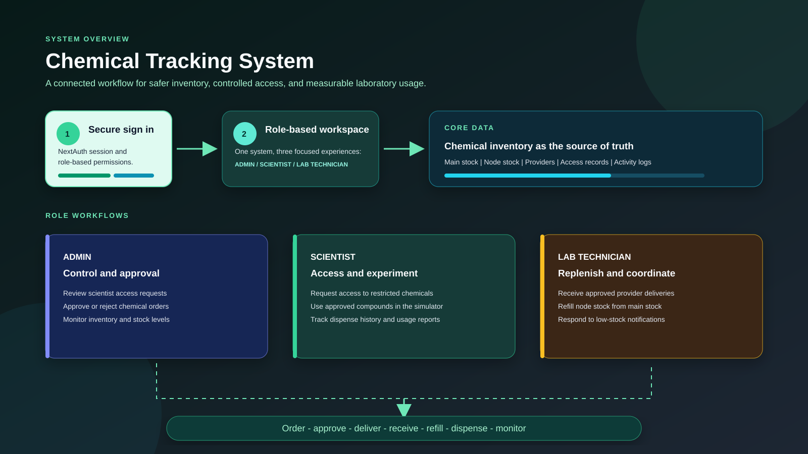
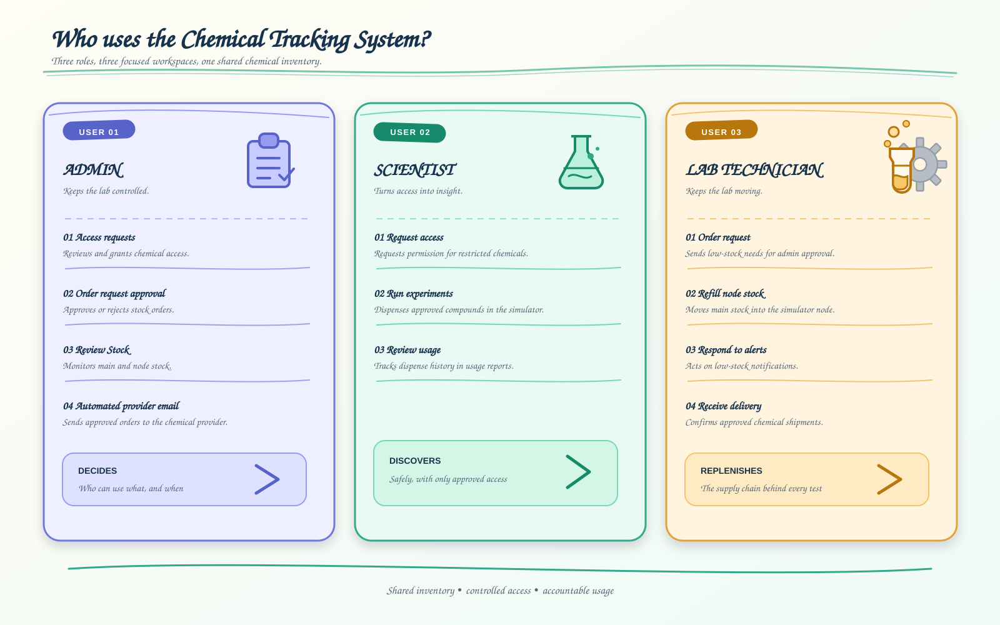

<div align="center">

# Chemical Tracking System

Laboratory inventory and chemical usage management for controlled access, stock monitoring, ordering, delivery, and simulation.

</div>

## Overview

The Chemical Tracking System connects laboratory stock management with role-based workflows. It tracks main stock and node stock, controls access to restricted chemicals, supports chemical ordering, and records simulator activity.



## User Roles



### Admin

- Review and approve or reject chemical access requests.
- Approve or reject chemical order requests.
- Review main stock and node stock.
- Automatically send approved orders to the chemical provider by email.

### Scientist

- Request access to restricted chemicals.
- Use approved chemicals in the laboratory simulator.
- Dispense measured quantities from node stock.
- Review personal chemical usage reports.

### Lab Technician

- Submit chemical order requests when stock is low.
- Receive approved deliveries.
- Refill simulator node stock from main stock.
- Monitor low-stock notifications.

## Main Workflow

1. A scientist requests access to a chemical.
2. An admin reviews and grants or rejects the request.
3. A lab technician requests stock when the inventory is low.
4. An admin approves or rejects the order.
5. The system sends approved order details to the chemical provider.
6. The lab technician receives the delivery and updates the order status.
7. Scientists dispense approved chemicals in the simulator.
8. Low-stock alerts and usage records keep the inventory accountable.

## Technology

- Next.js 16 with the App Router
- React 19 and TypeScript
- NextAuth credentials authentication with JWT sessions
- MongoDB with Mongoose
- Tailwind CSS
- Nodemailer for provider order emails

## Getting Started

### Requirements

- Node.js 20 or later
- npm
- MongoDB database
- SMTP account for automated order emails

### Install dependencies

```bash
npm install
```

### Configure environment variables

Create a `.env.local` file in the project root:

```env
MONGODB_URI=mongodb://localhost:27017/chemical-tracking-system

SMTP_HOST=smtp.example.com
SMTP_PORT=587
SMTP_USER=your-smtp-user
SMTP_PASS=your-smtp-password
SMTP_FROM=your-sender@example.com
```

`MONGODB_URI`, `SMTP_USER`, and `SMTP_PASS` are required. `SMTP_FROM` is optional and defaults to `SMTP_USER`.

### Run the development server

```bash
npm run dev
```

Open [http://localhost:3000](http://localhost:3000) in your browser.

## Available Scripts

```bash
npm run dev      # Start the development server
npm run lint     # Run ESLint
npm run build    # Create a production build
npm run start    # Start the production server
```

## Project Structure

```text
app/              Pages, layouts, server actions, and API routes
components/       Reusable client components and simulator UI
db/               MongoDB connection and Mongoose models
lib/              Shared utilities and email delivery
public/           Images, icons, and project overview diagrams
auth.ts           NextAuth configuration
middleware.ts     Route protection middleware
```

## Important Routes

| Route                    | Purpose                                  |
| ------------------------ | ---------------------------------------- |
| `/login`                 | Sign in                                  |
| `/`                      | Role-aware chemical inventory            |
| `/request-access`        | Scientist chemical access requests       |
| `/chemical-orders`       | Lab technician order requests            |
| `/admin/access-requests` | Admin access approval                    |
| `/admin/chemical-orders` | Admin order approval                     |
| `/receive-delivery`      | Delivery receiving workflow              |
| `/notifications`         | Lab technician stock alerts              |
| `/logs`                  | Scientist usage reports                  |
| `/simulator`             | Chemical dispensing and refill simulator |

## Notes

- Access is restricted by user role: `admin`, `scientist`, or `lab_technician`.
- Chemical stock values are displayed with up to three decimal places while calculations remain numeric.
- Keep `.env.local` out of version control because it contains database and SMTP credentials.
